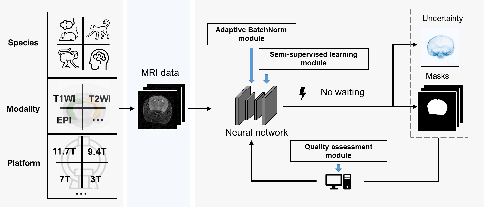
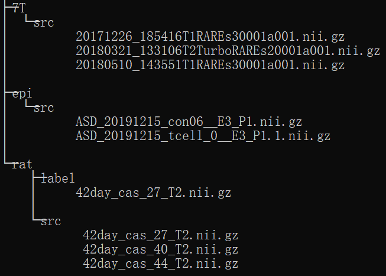

# BEN

BEN: a generalized Brain Extraction Net for multimodal MRI data from rodents, nonhuman primates, and humans

### [Paper](https://www.biorxiv.org/content/10.1101/2022.05.25.492956v2.abstract) | [Replicate demo](#replicate-demo ) | [MRI data release](/dataset_release) | [Pretrained weight](/dataset_release) | [Contents](#table-of-contents)



## Overview
🚀 Quick start to use BEN or replicate our experiments in 5 minutes!


### Code | replicate demo


| Name                                                    | Description                                                                                                                                                   | Related Fig.<br/> in paper | Snapshot                                                                                                  | Colab link                                                                                                                                                                                                                                                                                                                                  |
|---------------------------------------------------------|---------------------------------------------------------------------------------------------------------------------------------------------------------------|----------------------------|-----------------------------------------------------------------------------------------------------------|---------------------------------------------------------------------------------------------------------------------------------------------------------------------------------------------------------------------------------------------------------------------------------------------------------------------------------------------|
| 1. BEN workflow & architecture                          | BEN renovates the brain extraction workflow to adapt to multiple species, modalities and platforms                                                            | Fig. 1 & 2                 |                | This repo                                                                                                                                                                                                                                                                                                                                   |
| 2. ✨ Cross species task                                 | Fewer or even no labels are used when deploy BEN to new applications                                                                                          | Fig. 3                     |  | [](https://colab.research.google.com/drive/1qsBg-_6NxVFUJCk0tbTyQ7vY8_FLnrc9?usp=sharing)                                                                                                                                                                         |
| 3. Cross modality / platform                            | Fewer or even no labels are used when deploy BEN to new applications                                                                                          | Fig. S1 & S2               |         | [](https://colab.research.google.com/drive/14NWqdbkpsdt0cS4-SLCvcDmHLU05UlmV?usp=sharing)                                                                                                                                                                         |
| 4. Compare with other toolbox                           | BEN outperforms traditional SOTA methods and advantageously adapts to datasets from various domains across multiple species, modalities, and field strengths. | Fig. 4                     |                | [](https://colab.research.google.com/drive/1HgHgqli-mVuIj9QolJ85KEB8LJcgN5qh?usp=sharing)                                                                                                                                                                         |
| 5. Uncertainty & inter-rater variations                 | BEN provides a measure of uncertainty that potentially reflects rater disagreement                                                                            | Fig. 5                     |                | [](https://colab.research.google.com/drive/1xPVzA_FrZN1pI3l7fFRBlCNsRAEwQ0gG?usp=sharing)<br/>[](https://colab.research.google.com/drive/1MMglzvMXC8YHI58vSQbi7VbHl5xsBpKN?usp=sharing) |
| 6. ✨ Volumetric quantification for longitudinal studies | BEN improves the accuracy of atlas registration and benefits brain volumetric quantification compared with using other toolbox.                               | Fig. 6 & 7                 |                |                                                                                                                                                                                                                                                                                                                                             |


### Replicate demo


| Feature                       | Description                                                                                                                                                                                                    | Colab link                                                                                                                                                                                                                                                                                                                                  |
|-------------------------------|----------------------------------------------------------------------------------------------------------------------------------------------------------------------------------------------------------------|---------------------------------------------------------------------------------------------------------------------------------------------------------------------------------------------------------------------------------------------------------------------------------------------------------------------------------------------|
| Transferability & flexibility | BEN can adapt to different species, modalities and platforms through                                                                                                                                           | [](https://colab.research.google.com/drive/1qsBg-_6NxVFUJCk0tbTyQ7vY8_FLnrc9?usp=sharing)<br/>[](https://colab.research.google.com/drive/14NWqdbkpsdt0cS4-SLCvcDmHLU05UlmV?usp=sharing) |
| Quality assessment            | Unlike traditional toolboxes, which rely on manual inspection to assess the brain extraction quality, BEN incorporates a quality assessment module to automatically evaluate its brain extraction performance. | [](https://colab.research.google.com/drive/1MMglzvMXC8YHI58vSQbi7VbHl5xsBpKN?usp=sharing)                                                                                                                                                                         |
| Speed 🚀                      | Inference: Less than 1 sec/scan;<br/>Adaptation to a new imaging center/application: About 10 min for deployment.                                                                                              | -                                                                                                                                                                                                                                                                                                                                           |

### MRI data release | pretrained weight

The details can be found in this [folder](/fig).


## Table of Contents

* [Installation](#installation)
* [Quick start / Tutorial](#quick-start)
    + [Cross modality](#cross-modality) [](https://colab.research.google.com/drive/14NWqdbkpsdt0cS4-SLCvcDmHLU05UlmV?usp=sharing)
    + [Cross field strength](#cross-field-strength) [](https://colab.research.google.com/drive/14NWqdbkpsdt0cS4-SLCvcDmHLU05UlmV?usp=sharing)
    + [Cross species](#cross-species)  [](https://colab.research.google.com/drive/1qsBg-_6NxVFUJCk0tbTyQ7vY8_FLnrc9?usp=sharing)
    + [Try your data](#try-your-data) 
    + [Interface for neruoimaging toolboxes](#interface-for-neruoimaging-toolboxes)

+ [Other feature](#other-feature)
    + [Semi-supervised leaning](#semi-supervised-leaning)
    + [Quality assessment](#quality-assessment)

* [Data release](#data-release)
* [Notes](#Notes)

## Installation

An Nvidia GPU is needed for faster inference (less than 1s/scan on 1080ti gpu).

Requirements:

* tensorflow-gpu == 1.15.4
* Keras == 2.2.4
* numpy == 1.16
* simpleitk == 2.0
* opencv-python == 4.1
* matplotlib == 3.3.1

You need to download this repository and run following command:

```
cd path/to/repository/
pip install -r requirement.txt
```

The project folder looks like this:



## Quick Start

* All the undermentioned results can be repeated via our tutorial Notebook.
* New weight will be saved independently for further customized application.

### Cross modality

#### Results:

1. Modality: T2WI -> EPI
2. For this exemplar domain adaptation (DA) task, No label is used (zero-shot).
3. From top raw to the third raw: Raw image, Baseline result, BEN's result.

   

### Cross field strength:

1. Field strength: 11.7 T -> 7 T
2. For this exemplar domain adaptation (DA) task, No label is used (zero-shot).
3. From top raw to the third raw: Raw image, Baseline result, BEN's result.

   

### Cross species:

1. Species: Mouse -> Rat
2. For this exemplar domain adaptation (DA) task, only ONE label is used.
3. The segmentation results are shown in red, the ground truth are shown in orange.
4. From top raw to the fifth raw: Raw image, Zero-shot (0 label used), finetune (1 label used), BEN's result (1 label
   used), Ground truth.

   

5. (Optional) Just do some simple postprocessing here, e.g., only save the top-K largest connected regions.
6. Compared with other methods, it further shows BEN's advantages

   

## Interface for neruoimaging toolboxes

| Name       | Link                             |
|------------|----------------------------------|
| AFNI       | afni.nimh.nih.gov/afni           |
| ANTs       | stnava.github.io/ANTs/           |
| FSL        | fsl.fmrib.ox.ac.uk/fsl/fslwiki   |
| FreeSurfer | freesurfer.net                   |
| SPM        | fil.ion.ucl.ac.uk/spm            |
| Nipype     | pypi.org/project/nipype/         |

(coming soon ...)

## Other feature

(to update)

### Semi-supervised leaning

### Quality assessment

# Data release

* For details about datasets, please refer to our paper.
* The scans used in our tutorial could be downlowd via link in Colab Notebook.
* The complete datasets will be released via [zenodo.org](https://zenodo.org/). Any additional data related to this
  paper can be requested from the authors.

# Notes

Acknowledgements: TODO

Disclaimer: This toolkit is only for research purpose.

