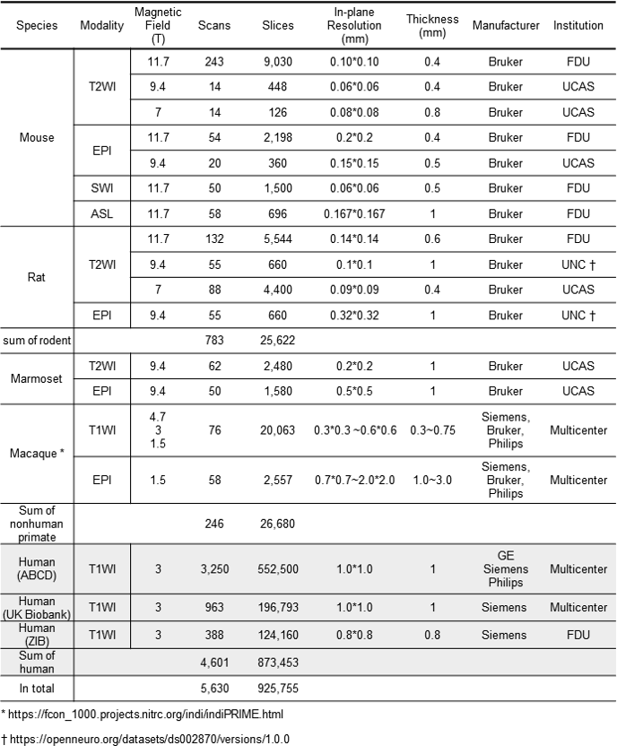

# MRI dataset and pretained weight

## [MRI dataset release](#1.0) | [Pretained weight](#2.0) | [Contributing to BEN](#3.0)

# 1. MRI dataset release
The dataset used in our paper (Table. S1)

## How to download/access the dataset

| Name             | Access link                                                          |
|------------------|----------------------------------------------------------------------|
| Mouse-T2WI-11.7T | [Zenodo](https://doi.org/10.5281/zenodo.6844489)                     |
| Rat-T2WI-9.4T    | [CAMRI](https://openneuro.org/datasets/ds002870/versions/1.0.0)      |
| Rat-EPI-9.4T     | [CAMRI](https://openneuro.org/datasets/ds002870/versions/1.0.0)      |
| Macaque-T1WI     | [PRIME-DE](https://fcon_1000.projects.nitrc.org/indi/indiPRIME.html) |
| Macaque-EPI      | [PRIME-DE](https://fcon_1000.projects.nitrc.org/indi/indiPRIME.html) |
| Human-ABCD       | [ABCD Study](https://abcdstudy.org/)                                 |
| Human-UKB        | [UK Biobank](https://www.ukbiobank.ac.uk/)                           |
| Others           | Available upon request                                               |

Note:
* For details about datasets, please refer to our [paper](https://www.biorxiv.org/content/10.1101/2022.05.25.492956v2.abstract).
* The scans used in our tutorial could be downlowd via link in Colab Notebook.
* Any additional data used in this paper can be requested from the corresponding author.

[//]: # (* The complete datasets will be released via [zenodo.org]&#40;https://zenodo.org/&#41;.)

# 2. Pretained weight

We provide all trained weight here via [Google Drive](https://drive.google.com/file/d/1aBrvDWtXRcLbwj3lKCln9SIcF-WWOt1D/view?usp=sharing). Users can deploy BEN as an out-of-the-box tool instantly if their data domain are contained within the after-mentioned lists.

In detail, for the introduction of a new dataset, we suggest that the user do as follows. 
1) First, use BEN to load the pretrained weights for the closest corresponding species.
2) Run unsupervised domain adaptation on the user’s dataset. The customized weight will be updated and saved automatically, and the user will then use it to execute BEN on their data.
3) Consider labeling several scans to fine-tune the model if the self-configuring weights do not yield satisfactory performance,

Pretrained weight list:

| Mouse            | Rat            | Marmoset           | Macaque           | Human                                                                                                       |
|------------------|----------------|--------------------|-------------------|-------------------------------------------------------------------------------------------------------------|
| Mouse-T2WI-11.7T | Rat-T2WI-11.7T | Marmoset-T2WI-9.4T | Macaque-T1WI-4.7T | Human-T1WI-3T  (trained on three datasets)                                                              |
| Mouse-T2WI-9.4T  | Rat-T2WI-9.4T  | Marmoset-EPI-9.4T  | Macaque-T1WI-3T   | Human-T1WI-ABCD-3T                                                                                          |
| Mouse-T2WI-7T    | Rat-T2WI-7T    |                    | Macaque-T1WI-1.5T | Human-T1WI-UKB-3T                                                                                           |
| Mouse-EPI-11.7T  | Rat-EPI-9.4T   |                    |                   | Human-T1WI-ZIB-3T                                                                                           |
| Mouse-EPI-9.4T   |                |                    |                   | [Human-T1WI-HCP (Baby)](https://drive.google.com/file/d/1NtRjX70N2xvnDB2Hj2Q3AhYag6HlT9FL/view?usp=sharing) |
| Mouse-SWI-11.7T  |                |                    |                   |                                                                                                             |
| Mouse-ASL-11.7T  |                |                    |                   |                                                                                                             |

(T2WI: Anatomical MRI; EPI: Functional MRI.)

# 3. Contributing to BEN
We are happy about any contributions! (MRI data / trained weight / plug-in function code)

BEN follows the open-access paradigm, allowing users to save their updated models and share their weights for use by the neuroimaging 
community.

Besides, the accumulation of additional imaging data will further improve the performance of BEN and support the exploration of complex neuroimaging research.

